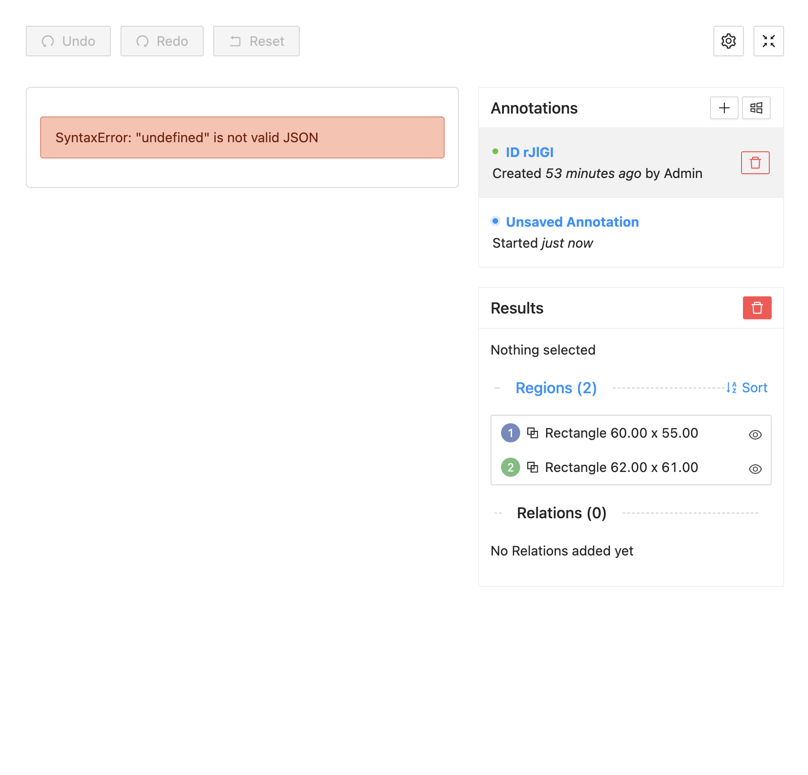
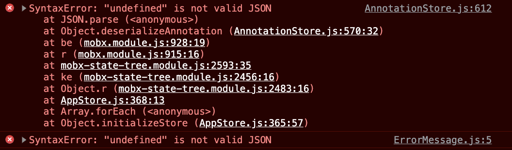
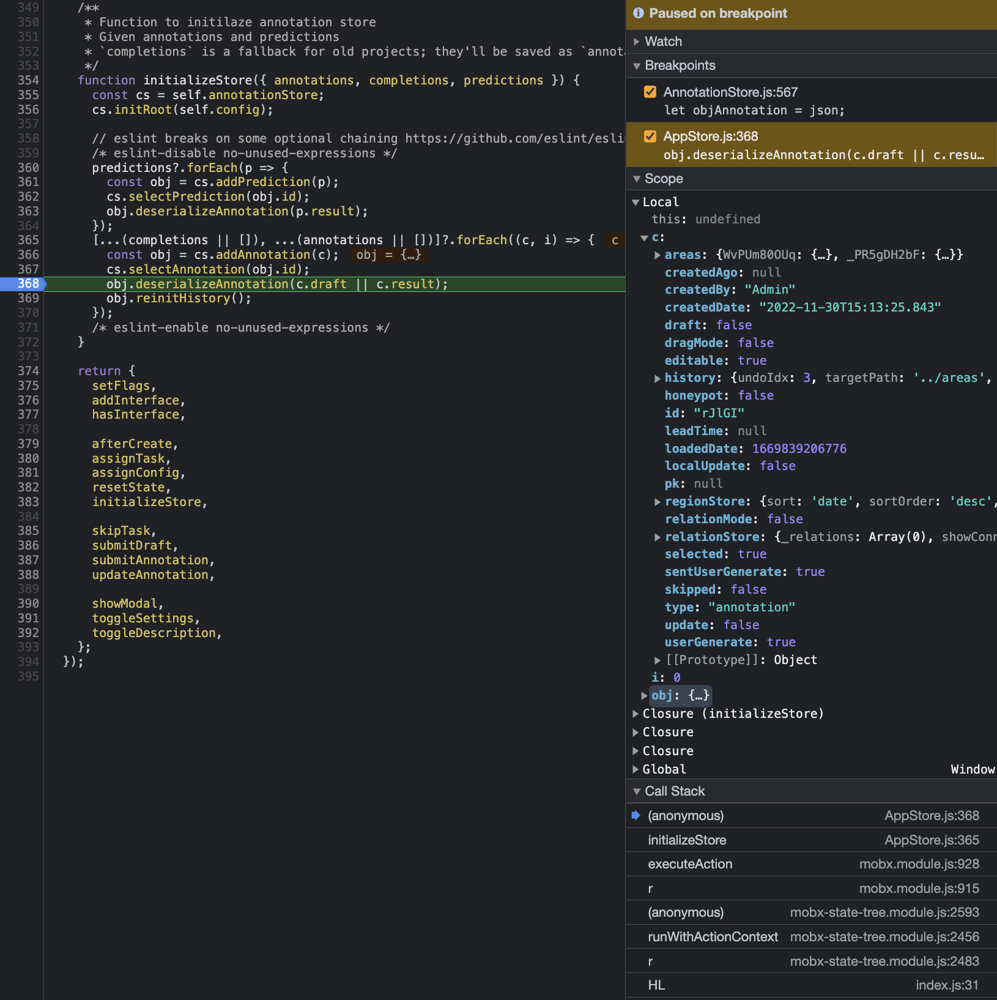
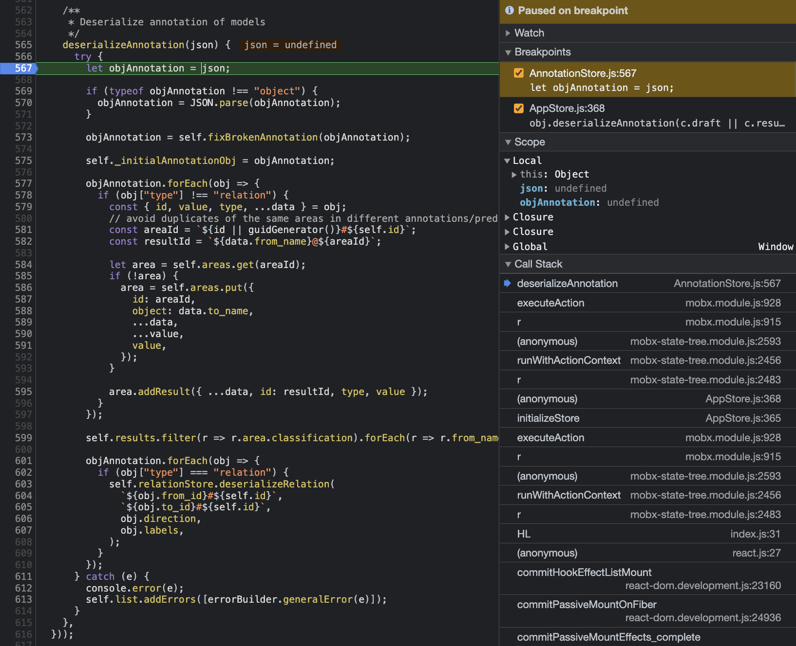

# About

This repo replicates an initializeStore error on Label Studio Frontend 1.4.0

somewhere along the call stack `deserializeAnnotation` is called with `undefined` as the argument instead of the provided annotation object

## Installation and Running

Serve files with an http server

### With NPM

Use NPM to install the global package live-server and run in directory

`npm install -g live-server`
`live-server`

### With Python

Use python to serve files over a simple http server

`python -m SimpleHTTPServer`
